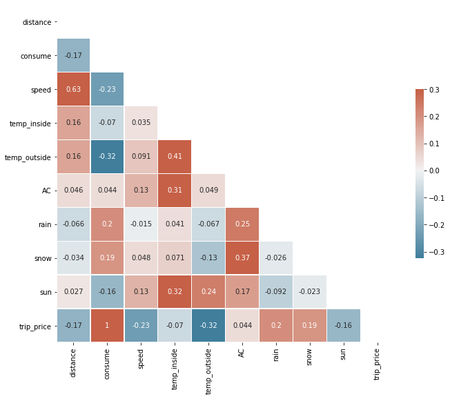
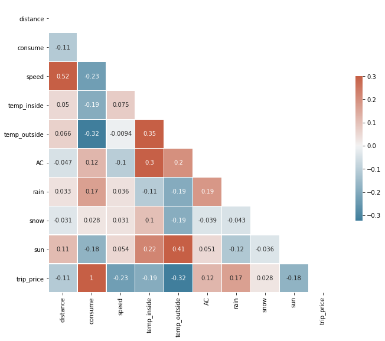
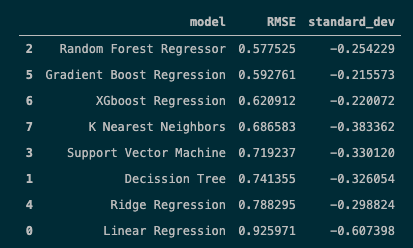
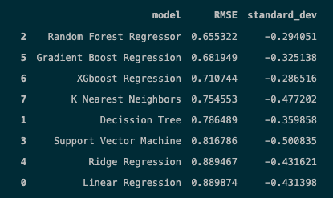
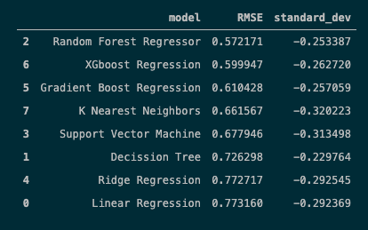
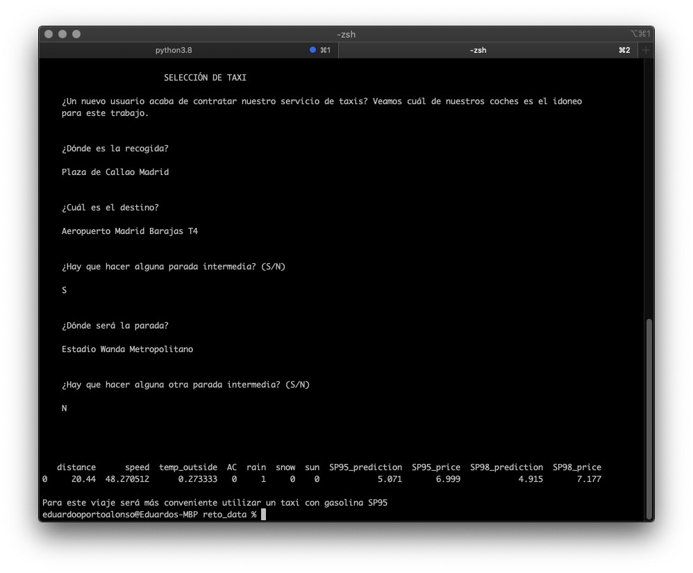

# Bienvenido al reto de Cobify 🚕

Cobify es una empresa dedicada al transporte de personas al estilo de Uber, Lyft o la propia Cabify que nos robó el nombre.

Cobify fue fundada en el año 92 coincidiendo con los JJ. OO. de Barcelona. Siempre nos hemos caracterizado por dos cosas:

- Operar sin licencia de ningún tipo. 💳
- El uso de coches de alta gama trucados. 🏎

Con la aparición de las licencias de VTC hemos podido salir de la clandestinidad y hemos comenzado a operar de manera legal. Pero nuestra otra seña de identidad siguen siendo los coches de alta gama trucados.

Somos un poco _de la vieja escuela_ y eso del análisis de datos como que nos parece un poco raro, pero como no para de salir en la tele queremos saber como puede ayudarnos en nuestro negocio.

##### Un poco de historia del problema de la gasolina ⛽️

Por si no lo sabías los coches trucados usan gasolinas con un alto índice de cetano como la SP98 para evitar retrasos/avance en la inyección de combustible (evitando el picado de biela), pero también hemos empezado a abrazar los combustibles que añaden etanol en sus formulaciones, son mas baratos y ofrecen el mismo índice de cetano que las gasolinas mas caras. Sin entrar en mas detalle (esto daría para un libro) nos estamos oliendo que esto de ser ecológico y moderno nos puede salir caro, parece que los coches consumen más en los trayectos.

##### El reto comienza aquí 📈

Ahora es tu turno: ¿puedes ayudarnos a elegir el mejor combustible?  

Nos hemos tomado la molestia de guardar algunos consumos en un .csv pero... no estaría de mas si puedes añadir algún dato más. El link con los datos es el siguiente: https://www.kaggle.com/anderas/car-consume?select=measurements.csv

Demuéstranos tus habilidades y justifica los 32k que queremos pagarte. Tienes 72h para entregar el reto desde este preciso instante 💸

##### Importante 🚧

- Límpia los datos
- Haz una visualización y busca relaciones entre ellos
- Cuenta la historia que cuentan los datos (storytelling)
- ¿Puedes hacer alguna regresión/clasificación o predicción de algún tipo?
- ¿Qué métricas obtienes?
- Explica tus conclusiones
- Consigue datos relacionados haciendo web scraping o con APIS
- Enriquece el dataset
- Mételo todo en una base de datos
- Haz tu propia API para servir datos / predicciones / gráficos

Para entregar tu propuesta haz fork del repo y cuando hayas terminado haz un pull. 🤯  
No olvides añadir cualquier documento como PDFs, Slides o todo aquello que se te ocurra.   
Puedes tomar ejemplo de nuestros instructores y montar algo con https://www.streamlit.io/ 🚀  

Vuelvete loc@ si quieres conseguir el puesto, el límite lo pones tu.

##### P.D: Aunque el tono es informal, el reto va en serio y es muy parecido a los que encontraréis en el mundo real. 🤔

# Solución

Mi aproximación a este problema se ha dividido en tres partes: 
 - Limpieza, completado y análisis de los datos disponibles 
 - Búsqueda de un modelo de predicción adecuado
 - Creación de una APP para la predicción de consumo de ambos tipos de gasolina dependiendo de los datos de un trayecto previamente registrado

### 1. Limpieza, análisis y visualización

Tods los pasos de este proceso están registrados en los notebooks de las carpetas [1_clean](https://github.com/EduOporto/reto_data/tree/main/1_clean) y [2_visual_and_story](https://github.com/EduOporto/reto_data/tree/main/2_visual_and_story). 

En la primera parte básicamente relleno valores nulos de algunas variables como 'temp_inside' (utilizando la media de los valores); unifico los datos de la variable 'specials' para que queden tan solo 4 tipos distintos, y así poder generar dummies de esa columna; paso a dummies la columna 'gas_type', para así dejar una soila columna; y por último añado el precio de cada trayecto. 

Una vez limpio y ordenado, guardo el dataset en un [nuevo csv](https://github.com/EduOporto/reto_data/blob/main/data/measurements_clean.csv)

Para la segunda parte analizo y relaciono todas las variables con el consumo, para extraer algunas ideas sobre los datos de los que disponemos e ir perfilando los datos con los que poder generar mi modelo de predicción. Estudio el consumo medio general por tipo de gasolina, y como influyen en el consumo elementos como distancia y velocidad del trayecto, temperatura exterior, aire acondicionado, o elementos como la lluvia, la nieve o el sol, para descubrir que el consumo tiende a dispararse más de lo normal en trayectos en los que temperatura, distancia y velocidad son bajas por lo general, y más especificamente si el aire acondicionado está activado, que el consumo medio es un poco más bajo con sol o que la lluvia tiende a disparar el consumo para ambos tipos de gasolina.

Por último analizo las correlaciones entre las variables, separando cada tipo de gasolina.

#### Correlación de variables para gasolina SP95

#### Correlación de variables para gasolina SP98

Tras deshacerme de algunas variables como 'refill liters', 'refill gas', 'refill_spent' o 'no_special', guardo el dataframe resultante en [measurements_model.csv](https://github.com/EduOporto/reto_data/blob/main/data/measurements_model.csv), quedando los datos listos para entrenar el modelo de predicción.

### 2. Modelo de predicción

Todo este proceso queda registrado en la carpeta [3_modeling](https://github.com/EduOporto/reto_data/tree/main/3_modeling), en la que además genero varias [funciones](https://github.com/EduOporto/reto_data/tree/main/3_modeling/modeling_support) para normalizar y escalar los datos, y para probar hasta 8 modelos de regresión diferentes.

Utilizo dos aproximaciones distintas, en las cuales varía el número de variables que tengo en cuenta, y en las que siempre tengo en cuenta la división de los trayectos por tipo de gasolina utilizada. 

Para la primera prescindo tan solo de las variables trip_price y temp_inside (SP95/SP98):

Para la segunda prescindo de las variables trip_price, temp_inside, sun, rain y snow (SP95/SP98):

Como los resultados no diferen demasiado de un modelo a otro, finalmente me decanto por utilizar la selección de datos del primer modelo, para realizar una Random Forest Regression. Guardo ambos dataframes, esta vez por separado ([sp95.csv](https://github.com/EduOporto/reto_data/blob/main/3_modeling/random_forest/data/sp95.csv) y [sp98.csv](https://github.com/EduOporto/reto_data/blob/main/3_modeling/random_forest/data/sp98.csv)), y entreno el modelo definitivo en la carpeta [random_forest](https://github.com/EduOporto/reto_data/tree/main/3_modeling/random_forest).

Tras regular los parámetros del modelo mediante RandomizedSearchCV y GridSearchCV, elijo los modelos que mejores resultados arrojan, y los guardo en la carpeta [models](https://github.com/EduOporto/reto_data/tree/main/3_modeling/random_forest/models) para su posterior uso.

### 3. APP para la predicción de consumos

Por último, y gracias a estos modelos, creo una aplicación que, gracias a las APIs de [Google Maps Directions](https://developers.google.com/maps/documentation/directions/overview) y [OpenWeatherMap](https://openweathermap.org/current) es capaz de extraer datos sobre la distancia, la velocidad media, la temperatura exterior y la existencia de algun fenómeno meteorológico especial (lluvia, nieve o sol) en una ruta previa.

La aplicación, ejecutable mediante el archivo [gas_chooser.py](https://github.com/EduOporto/reto_data/blob/main/gas_chooser.py), preguntará al usuario el lugar de recogida del usuario/os del taxi, el lugar de destina e incluso de hay alguna parada en el trayecto, y con esos datos predecirá el consumo para cada tipo de gasolina, escogiendo aquella que sea más rentable para ese trayecto.

## Futuras mejoras

 - Crear un servicio API más accesible, investigar la herramiento de [Streamlit](con https://www.streamlit.io/).
 - Intentar implementar otros modelos para ver si mejoran la exactitud de las predicciones.

