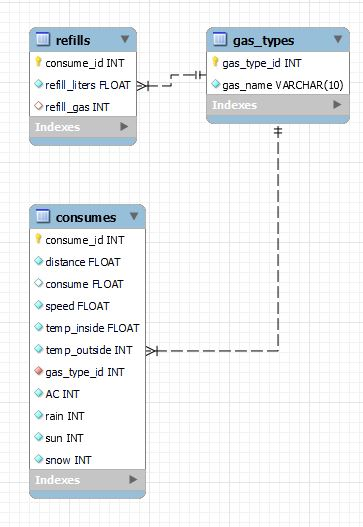

# Cobify Interview Challenge (Ironhack)🚕

This is an ironhack project similar to an interview case study for a data analyst position. I used data from a car consume on two different fuels (SP98 and E10).
I've used MySQL to store the data, python for the ETL process and streamlit to present the my analysis and conclusions.

This project has several stages defined:
1. Dataframe cleaning and manipulation.
2. Data analysis and visualization.
3. Using API to get more data.
4. MySQL database structure and tables creation.
5. Creating a web page with streamlit. 

## Conclusions:
I would choose E10 because:
- SP98 consumes slightly less in general but E10 has a more predictable consume.
- E10 has a slightly less consume on warm days (more than 10°C).
- E10 consume less on low speeds (less than 30 km/h).
- E10 has a lower price (1.4522 euros/liter) than SP98 (aproximately 1.6 euros/liter)
This analysis have been made with a low amount and manually colected data.
- E10 is more environmental friendy.

## Recommendations and future steps:
- Collect more data, collect data from different cars and more precise data (consume vs speed in real time during each trip, not average consume or speed) to make better decisions.
- Define priority countries for Cobify to proceed with a E10 fuel availability analysis.
- SP98 and E10 price check in each priority country. This analysis was focused on Spain and prices may vary a lot in each country.

## Files structure:

- Python file (main.py): File that initialize the streamlit page.
- "config" folder with:
    - Python file (configuration.py) with all the basic configurations to connect to MySQL.
- "mysql" folder:
    - SQL file (create-db.sql): MySQL file to create from zero the database necesary for this project.
    - SQL file (queries.sql): MySQL file used to test some query and how the db and the tables were working.
- "tools" folder with:
    - Python file (functions.py): File with all general functions.
- "notebooks" folder with several Jupyter Notebooks:
    - Jupyter notebook file (exploration.ipynb): Initial jupyter notebook for the exploration steps with the initial dataset.
    - Jupyter notebook file (cleaning.ipynb): Jupyter notebook file with the cleaning process of the dataset.
    - Jupyter notebook file (importing_to_mysql.ipynb): Jupyter notebook file importing dataframes to mysql tables.
    - Jupyter notebook file (api.ipynb): Jupyter notebook file getting new data from 
    Ministry of Industry, Commerce and Tourism of Spain.
    - Jupyter notebook file (analysis_visualization.ipynb): Jupyter notebook file with the analysis and visualization process.
- "image" folder with different images of plots and the portrait of this project.
- "data" folder with several CSV files:
    - "measurements.csv": Data from kaggle.
    - "consume_data.csv": Dataset with each trip data.
    - "refill_data.csv": Dataset with each gas refill data.

## Libraries used:

- [Pandas](https://pandas.pydata.org/)
- [Sqlalchemy](https://www.sqlalchemy.org/)
- [Streamlit](https://docs.streamlit.io/en/stable/api.html)
- [JSON](https://docs.python.org/3/library/json.html)
- [Requests](https://docs.python-requests.org/en/master/)
- [Dotenv](https://pypi.org/project/python-dotenv/)
- [Seaborn](https://seaborn.pydata.org/introduction.html)

## Dataset used:

- [Car Fuel Consumption](https://www.kaggle.com/anderas/car-consume)

## DB used:

- [MySQL](https://www.mysql.com/)

### MySQL Structure:

