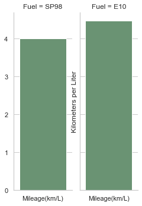
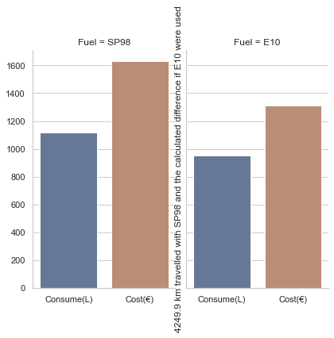

 # Fuel Efficiency for Cobify Taxi Service

 We are gong to work with a data set from Kaggle:
 https://www.kaggle.com/anderas/car-consume?select=measurements.csv

 We want to do as much work as possible on this. It's an open book. 

 Some of the possibilities:
 - Clean/Modify dataset
 - Visualize and find relationships with the data
 - Tell a story
 - Explore Regression/Categorical predictions
 - Webscrape or use API requests if we like
 - Create our own API to update a database that we create

# Step 1: Clean Data
The dataset contains `specials` data column whose values are also reflected in dummy values in columns `AC`, `rain`, `sun`. We are going to drop `specials`, `Rain`, and `sun`. 
The "AC" column will com in handy later so we will drop it only to bring it back later.

We also have to cast all the values to `float`. At the moment they are comma-decimals and not period-decimals. So we convert all commas to periods and then cast them as `float`. 

# Step 2: Explore Visualizations
After doing some calcuations we discovered that SP98 was less efficient than E10:

```
------------------------------
Kilometers per liter E10:
4.471730619659065
------------------------------
Kilometers per liter SP98:
4.008745071879544
------------------------------
```


We also found an orientative price per litre of `E10` and `SP98`.
- `E10 is sold for 1,38€; SP98 is sold for 1,46€; per liter.`

We applied this information to the `SP98` dataset we had separated to find out how much we could have saved if we had used `E10` instead.

So we created a new dataset derived from the `SP98` data that:
- first we applied the mileage of `E10` to the total of the distance travelled with `SP98` to get a hypothetical consumption.
- then we calculated the cost by applying the price per liter and we got a 20% savings.

```
Distance travelled with SP98:                 4249.9 km
--------------------------------------------------
Total fuel consuption with SP98:              1117.0 ltr
Total cost of using SP98:                     1630.82€
--------------------------------------------------
--------------------------------------------------
Total fuel consumption if E10 were used:      950.39 ltr
Total cost if E10 were used:                  1311.54
Total we could have saved:                    319.28€
--------------------------------------------------
That is 14.92% less fuel consumed.
And a 19.58% savings by using E10 fuel.
```




